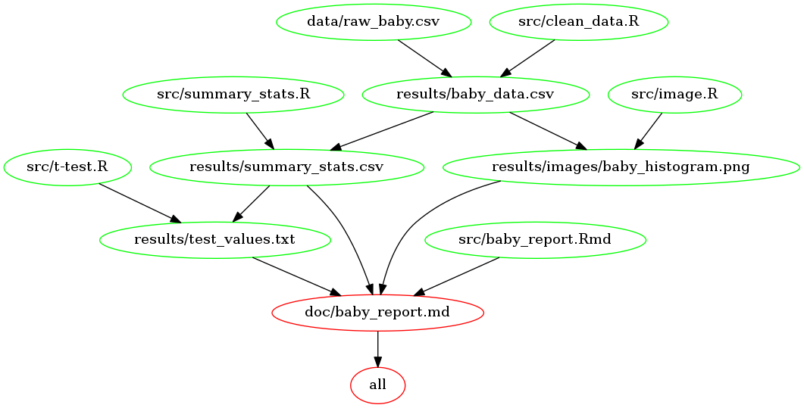

# Baby weights by sex
## Do girls weigh more than boys at birth?
### Amy Goldlist

What are the differences between male and female babies at birth?  Is there a size difference?  I've used the data set ["Live births, by birth weight and sex, Canada, provinces and territories"](http://open.canada.ca/data/en/dataset/ea67173c-4f76-4259-83e5-557e97ae85fd) available through the Government of Canada Open Data website.  This dataset contains data on babies born between 2000 and 2014, classified by sex and weight range.

My hypothesis on starting was that female babies weigh more than male babies at birth, but in fact my analysis has shown that male babies weigh more on average than female babies at birth!

In the next release, I would like to look at the effect of province or territory or birth on birthweights.


### To Run:

1. Clone the repo.

2. You will need to have docker installed and running on your computer.

3. First, pull my docker image from dockerhub: `docker pull goldlist/baby_weights_by_sex`

4. Run the make file by running in the command line:
`docker run --rm -v C:/Users/path/to/repo/Baby_weights_by_sex:/home/baby_weights_by_sex goldlist/baby_weights_by_sex make -C '/home/baby_weights_by_sex' `

5. To clean the files, simply run `docker run --rm -v C:/Users/path/to/repo/Baby_weights_by_sex:/home/baby_weights_by_sex goldlist/baby_weights_by_sex make -C '/home/baby_weights_by_sex' clean `

6. In steps 4 and 5, make sure to replace `C:/Users/path/to/repo/Baby_weights_by_sex` with the path to the cloned repo on your computer.

If you don't want to use docker, you can and run the make file from the root directory of the cloned repo by using the command
```
make all
```
This will clean the data, create images, and run the analysis.  It will them compile this into a report.  The Make file runs the data as in this dependency graph:



But remember to check out the list of dependencies below.

### List of key files:

| file   | Description |
|--------|-------------|
| [README](README.md) |   *Overview of project*    |
| [LICENSE](LICENSE.md) |   *MIT license here*    |
| [Report](doc/baby_report.md) | *A completed report on baby weights* |
| [Makefile](Makefile) | *A make file to run everything*

### Dependencies
The analysis is done with R, (3.4.3), with the following packages:

* library(tidyverse)
* library(stringr)
* library(forcats)
* library(SDMTools)
* library(scales)
* library(ezknitr)

The documents are rendered with Make.

The above graph is created with makefile2graph.

#### packrat

In order to run the R packages above, packrat is included.  If you open [the Rproj file](Baby_weights_by_sex.Rproj), then packrat will be installed, and you will not have to install the correct packages

#### Docker

If you would like to run the complete report without any installs, use my docker container available on dockerhub as: `goldlist\baby_weights_by_sex`.  Once this is built, you can run the make file using the following command:

`
docker run --rm -v C:/Users/path/to/repo/Baby_weights_by_sex:/home/baby_weights_by_sex goldlist/baby_weights_by_sex make -C '/home/baby_weights_by_sex'
`

To clean all the created files, run:

`
docker run --rm -v C:/Users/path/to/repo/Baby_weights_by_sex:/home/baby_weights_by_sex goldlist/baby_weights_by_sex make -C '/home/baby_weights_by_sex' clean
`

Make sure you replace the string `C:/Users/path/to/repo/Baby_weights_by_sex` with the path to the cloned repo on your own computer.

### Licensing Details

  The data used is licensed under an [Open Government License- Canada](http://open.canada.ca/en/open-government-licence-canada)
